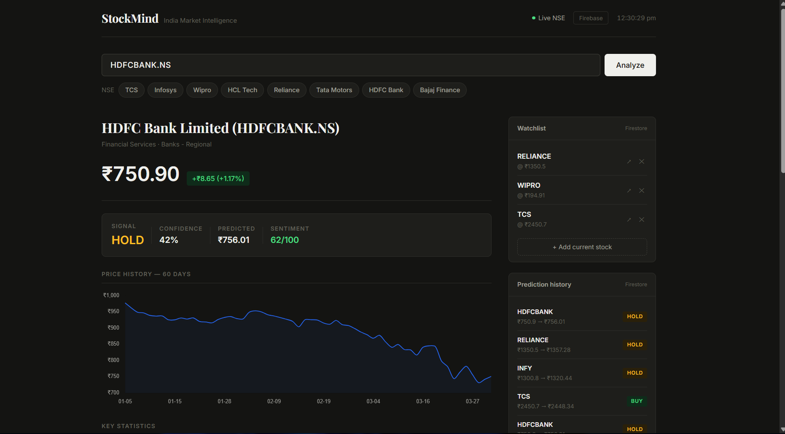
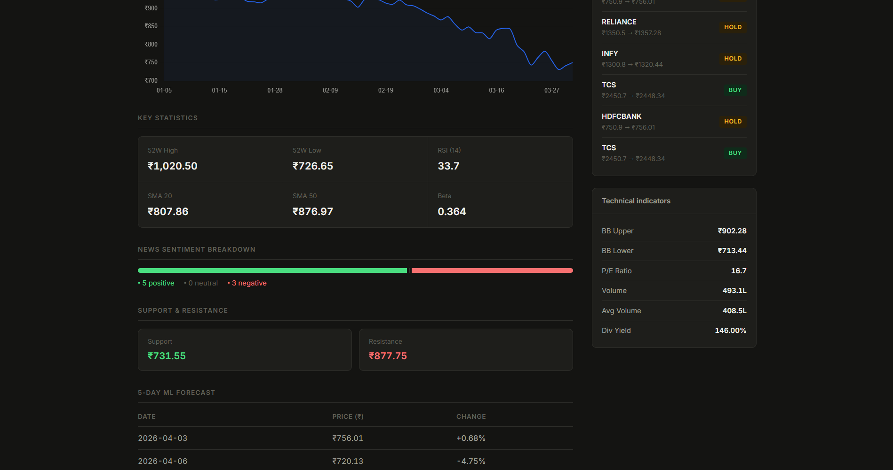

# StockMind — India Market Intelligence

Real-time stock analysis platform for NSE equities. Combines live market data, NLP sentiment analysis on news headlines, and ML-based price prediction into a clean web dashboard backed by Firebase.

---

## What it does

- Fetches live NSE stock prices and technical indicators via Yahoo Finance
- Analyses news sentiment using VADER NLP and scores it 0-100
- Predicts next-day price movement using Random Forest + Linear Regression
- Generates a BUY / HOLD / SELL signal with confidence score
- Saves watchlists and prediction history to Firebase Firestore

## Tech Stack

Python, FastAPI, scikit-learn, VADER NLP, yfinance, Firebase Firestore, Chart.js, Docker

## Running locally

**Windows**
```
run.bat
```

**Mac / Linux**
```bash
chmod +x run.sh && ./run.sh
```

Then in a second terminal:
```bash
cd frontend && python -m http.server 3000
```

Open `http://localhost:3000`. Backend runs on `http://localhost:8000`.

## Running with Docker

```bash
docker-compose up --build
```
## Screenshots



## Notes

No paid APIs required. All market data is sourced from Yahoo Finance for free. Firebase is optional — the app runs fully without it, Firebase only enables watchlist persistence and prediction history.
